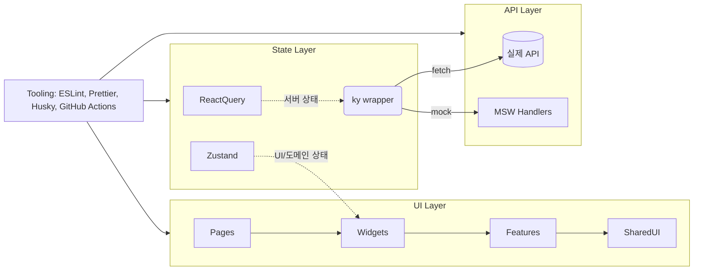

# Front Wireframe – React + TypeScript + Tailwind Boilerplate

배급자·번역가 협업을 위한 더빙 파이프라인 목업 프로젝트입니다. 5명의 초보 프론트엔드 팀이 빠르게 화면을 확장하고 실제 기능을 붙일 수 있도록 **React + Vite + Tailwind** 기반의 구조, 규칙, 예시 구현을 제공합니다.

- 필수 화면: 홈, 로그인, 회원가입, 워크스페이스, 프로젝트 목록/상세, 편집기
- 상태 관리: **React Query**(서버 상태) + **Zustand**(전역 UI/도메인 상태)
- UI 구성: **Radix UI + TailwindCSS + lucide 아이콘**
- API 계층: **ky** 래퍼 + 환경별 설정 + **MSW** 모킹
- 협업 규칙: ESLint + Prettier + Husky + lint-staged + Conventional Commits

---

## 🚀 로컬 실행 3단계

1. **필수 버전 설치**
   ```bash
   nvm use
   corepack enable && corepack prepare pnpm@9.12.2 --activate
   ```
2. **환경 변수 설정**
   ```bash
   cp .env.example .env
   # 필요 시 .env.development / .env.production도 수정
   ```
3. **의존성 설치 & 개발 서버 실행**
   ```bash
   pnpm install
   pnpm dev
   ```

---

## 🧱 기술 스택

| 범주        | 선택                                                      |
| ----------- | --------------------------------------------------------- |
| UI          | React 18, Vite, TailwindCSS, Radix UI, lucide-react       |
| 상태        | React Query, Zustand                                      |
| 유효성      | Zod + React Hook Form                                     |
| API         | ky(HTTP 래퍼), MSW(모킹)                                  |
| 테스트      | Vitest + Testing Library, Playwright (E2E)                |
| 품질        | ESLint, Prettier, tailwindcss-animate, lint-staged, Husky |
| 문서/자동화 | Storybook, GitHub Actions CI                              |

### 주요 스크립트

| Script                       | 설명                                           |
| ---------------------------- | ---------------------------------------------- |
| `pnpm dev`                   | Vite 개발 서버 (MSW 자동 시작, `/api` → proxy) |
| `pnpm build`                 | 타입 검사 후 프로덕션 빌드                     |
| `pnpm preview`               | 빌드 결과 미리보기                             |
| `pnpm lint`                  | ESLint (+ unused-imports, tailwindcss plugin)  |
| `pnpm format`                | Prettier 전체 포맷                             |
| `pnpm typecheck`             | `tsc --noEmit`                                 |
| `pnpm test` / `pnpm test:ui` | Vitest 단위 테스트 / UI 모드                   |
| `pnpm test:e2e`              | Playwright E2E (dev 서버 자동 기동)            |
| `pnpm story`                 | Storybook (옵션)                               |

Husky는 `pnpm install` 시 자동으로 `pre-commit` 훅(lint-staged)을 설정합니다.

---

## 🗂️ 폴더 구조 요약

```
src/
├─ app/              # 라우터 & 전역 Provider
├─ pages/            # 라우트 단위 화면 (V-HOME-01 등)
├─ features/         # 도메인별 로직/컴포넌트 (auth, projects, editor)
├─ widgets/          # 복합 UI (헤더, 사이드바, 목록 등)
├─ entities/         # 타입/더미 데이터 (Project, Segment 등)
├─ shared/
│  ├─ api/           # ky 클라이언트, MSW 핸들러
│  ├─ config/        # env, routes, query keys
│  ├─ lib/           # utils, analytics
│  ├─ store/         # Zustand 전역 상태 (auth/ui/editor)
│  ├─ styles/        # Tailwind 엔트리
│  └─ ui/            # 공통 UI 토큰 (Button, Tabs, Dialog…)
├─ stories/          # Storybook 예시
└─ tests/            # Vitest 세팅
```

---

## 🏛️ 아키텍처 개요



### 상태 관리 가이드

- **React Query**
  - `queryKeys`에 명명 규칙을 정의 (`projects.all`, `projects.detail(id)`, `editor.state(id)`)
  - `AppProviders`에서 `staleTime`, `refetchOnWindowFocus` 기본 옵션 설정
  - `useProjects`, `useProject`, `useEditorState`로 쿼리/프리패치 예시 제공
- **Zustand**
- `useAuthStore`: 로그인 여부와 사용자 정보 관리
  - `useUiStore`: 토스트, 프로젝트 생성 모달 단계(`source → details`)
  - `useEditorStore`: 활성 세그먼트, 재생 속도, 분할 모드, 선택 트랙

### API & Mock

- `src/shared/api/client.tsx`에서 **ky 인스턴스** 생성 (공통 헤더, 토큰, 지수 백오프 재시도)
- Vite dev 서버는 `/api` 요청을 `.env.*`의 `VITE_API_BASE_URL`로 proxy
- 개발 모드에서 `VITE_ENABLE_MSW=true`면 MSW 워커가 자동 기동
- 모킹 핸들러(`handlers.ts`)는 `/api/projects`, `/api/projects/:id`, `/api/editor/:id`를 제공

---

## 📋 화면별 scaffold 메모

- **홈(V-HOME-01)**: Hero + 예제 영상 카드 + 언어 토글 + CTA (로그인/회원가입)
- **로그인(V-AUTH-Entry-01)**: `RoleToggle`(배급사/편집자), `react-hook-form` + `zod`, Google SSO 버튼
- **회원가입(V-AUTH-Signup-01)**: 사용자이름 필수, 약관 동의 체크 (역할 선택은 추후 확장)
- **워크스페이스(V-DIST-Workspace-01)**: 사이드바 + 업로드 카드 + 프로젝트 리스트, 모달 라우팅(`?create=source|details`)
- **프로젝트 생성 모달(D-5~7)**: 2단계(소스 연결 → 자동 더빙 설정) `zod` 유효성, Next 비활성 처리, 완료 시 토스트
- **프로젝트 목록(V-PROJ-List-01)**: 검색/정렬/탭(할당됨|완료) + 진행률 바
- **프로젝트 상세(V-PROJ-Detail-01)**: 언어 탭 → 플레이어 전환, 결과물 카드, 역할별 CTA
- **편집기(V-EDT-Editor-01)**: 세그먼트 리스트 + 파형 목업 + 화자/보이스 매핑 + 툴바(번역 반영/저장)

---

## 🧑‍🤝‍🧑 초보 5인이 지켜야 할 규칙

1. **커밋 메시지**는 항상 Conventional Commits 규칙(`feat:`, `fix:`, `docs:`…)을 따른다.
2. **브랜치 전략**: `main` 보호, 기능은 `feature/*`, PR은 최소 1인 코드 리뷰 후 병합.
3. 새 기능을 만들 때는 **페이지 → 위젯 → 피처 → 엔티티** 순으로 책임을 분리하고, 공통 UI는 `shared/ui`에 추가한다.
4. **서버 상태는 React Query**, **전역 UI/도메인 상태는 Zustand**에만 넣는다. 둘을 혼용하지 않는다.
5. Tailwind 클래스를 작성할 때는 **컴포넌트 상단 → 레이아웃 → 타이포 → 상태 순서**로 선언하고, 필요 시 `cn()`으로 조건부 처리한다.
6. 접근성: Radix 컴포넌트 활용, 모든 인터랙티브 요소에 `aria-label` 또는 의미 있는 텍스트를 제공한다.
7. **Storybook**이나 **Vitest**로 스토리/테스트 틀을 추가하고 TODO 주석으로 최소 기대 사항을 남긴다.
8. PR에는 **화면 스크린샷**과 **테스트 결과**를 첨부한다 (CI 체크 확인).

---

## 🔄 CI & 품질

- `.github/workflows/ci.yml`: pnpm 설치 → lint → test → typecheck → build
- `eslint.config.js`: React, TypeScript, import/order, unused-imports, tailwindcss plugin 포함
- `prettier.config.cjs`: Tailwind 클래스 정렬 플러그인 적용
- Husky `pre-commit`: `lint-staged`가 변경된 파일만 체크 (TS/TSX는 ESLint + Prettier)

---

## 🔮 다음 단계 제안

1. **디자인 시스템 확장**: `shared/ui` 컴포넌트를 Storybook에서 정리하고 더 많은 Radix 패턴 적용
2. **실제 API 연동**: MSW 핸들러를 참고해 백엔드 계약을 맞춘 뒤 ky 인스턴스만 교체
3. **상세 상태 로직 구현**: 프로젝트 생성 후 React Query invalidate, 편집기 Mutation → 알림 시스템
4. **접근성 & 성능 검토**: Lighthouse / axe 체크, 라우트별 코드 스플리팅 (`lazy` 사용 중)

필요한 추가 작업이나 자동화가 있다면 `docs/adr`에 결정을 기록하고 팀과 합의하세요. 즐거운 협업을 응원합니다! ✨
